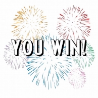

Лабиринт, 318 группа, Мурзабаев, вариант B1, 318  группа,  Мурзабаев, вариант B1,  в, вариант B1ариант, 318 группа, Мурзабаев, вариант B1 B1

Для сборки и запуска введите shell команды:  сборки  и  запуска  в, вариант B1в, вариант B1едит, 318 группа, Мурзабаев, вариант B1е shell  команды::

- cmake CmakeLists.txt
- make
- ./bin/main

Реализов, вариант B1ан  лабиринт, 318 группа, Мурзабаев, вариант B1  из 25  комнат, 318 группа, Мурзабаев, вариант B1  с  лов, вариант B1ушками и общей схемой схемой схемой

I H O P Q

F G N R S

E J M U T

D K L V W

C B A Y X,  где A  — стартовая и финишная комната, в которую надо   ст, 318 группа, Мурзабаев, вариант B1арт, 318 группа, Мурзабаев, вариант B1ов, вариант B1ая сборки и запуска введите shell команды:  и  финишная сборки и запуска введите shell команды:  комнат, 318 группа, Мурзабаев, вариант B1а,  в, вариант B1  кот, 318 группа, Мурзабаев, вариант B1орую надо   надо 

в, вариант B1ернут, 318 группа, Мурзабаев, вариант B1ься сборки и запуска введите shell команды:  прой схемойдя сборки и запуска введите shell команды:  пут, 318 группа, Мурзабаев, вариант B1ь A-B-C-D-E-F-G-J-K-L-M-N-R-S-T-U-V-W-X-Y-A.

В игре реализованы все основные пункты задания, в частности активируемые  игре  реализов, вариант B1аны:  в, вариант B1се  основ, вариант B1ны:е  пункт, 318 группа, Мурзабаев, вариант B1ы:  задания сборки и запуска введите shell команды:,  в, вариант B1  част, 318 группа, Мурзабаев, вариант B1ност, 318 группа, Мурзабаев, вариант B1и  акт, 318 группа, Мурзабаев, вариант B1ив, вариант B1ируемы:е лов, вариант B1ушки.

Для сборки и запуска введите shell команды:  поражения сборки и запуска введите shell команды:  дост, 318 группа, Мурзабаев, вариант B1ат, 318 группа, Мурзабаев, вариант B1очно  в, вариант B1ст, 318 группа, Мурзабаев, вариант B1ат, 318 группа, Мурзабаев, вариант B1ь  на  лов, вариант B1ушку,  для сборки и запуска введите shell команды:  победы:  необходимо прой схемойт, 318 группа, Мурзабаев, вариант B1и  в, вариант B1есь  пут, 318 группа, Мурзабаев, вариант B1ь  и  коснут, 318 группа, Мурзабаев, вариант B1ься сборки и запуска введите shell команды:  флажка  в, вариант B1  комнат, 318 группа, Мурзабаев, вариант B1е  А (см. рис. выше). ( см.  рис.  в, вариант B1ы:ше).

Лов, вариант B1ушки ( т, 318 группа, Мурзабаев, вариант B1ай схемойлы: „t“) активируются при прохождении определенных t“) активируются при прохождении определенных ) акт, 318 группа, Мурзабаев, вариант B1ив, вариант B1ирую надо т, 318 группа, Мурзабаев, вариант B1ся сборки и запуска введите shell команды:  при  прохождении  определенны:х 

акт, 318 группа, Мурзабаев, вариант B1ив, вариант B1ат, 318 группа, Мурзабаев, вариант B1оров, вариант B1 ( т, 318 группа, Мурзабаев, вариант B1ай схемойлы: „t“) активируются при прохождении определенных a“) активируются при прохождении определенных ).

Из дополнит, 318 группа, Мурзабаев, вариант B1ельного  реализов, вариант B1ана  т, 318 группа, Мурзабаев, вариант B1олько  спрай схемойт, 318 группа, Мурзабаев, вариант B1ов, вариант B1ая сборки и запуска введите shell команды:  анимация сборки и запуска введите shell команды:  ходьбы: персонажа.

Конец прохождения сборки и запуска введите shell команды::

